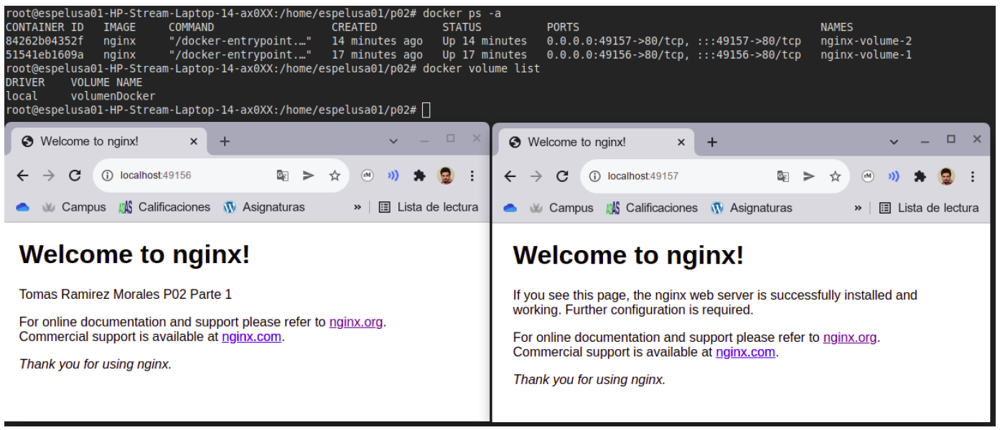
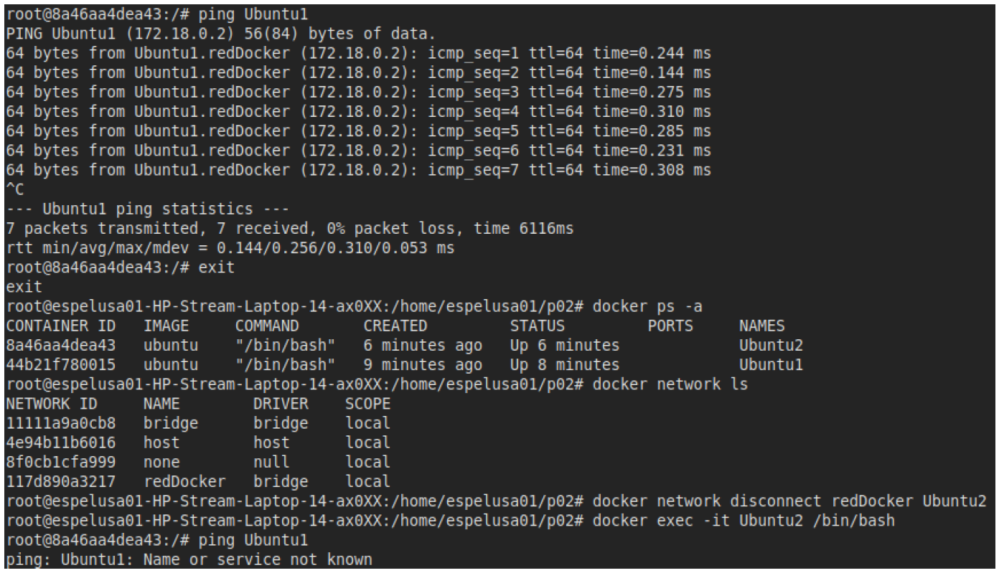

# Tarea: Práctica 2

Subir un documento PDF con los comandos realizados para resolver los siguientes ejercicios propuestos. Incluir también la respuesta a las preguntas realizadas y capturas donde se requiera mostrar en el navegador el correcto funcionamiento de los contenedores.

---

## Parte 1

1. Crear volumen compartido `volumenDocker`
2. Crear un contenedor de Nginx que use el volumen `volumenDocker`.
3. Modifique el contenido del fichero `index.html` incluyendo un saludo personal en lugar del texto por defecto.
4. Cree un segundo contenedor que también use el volumen `volumenDocker`.
5. Compruebe que puede acceder a `localhost:80` (primer contenedor) y `localhost:81` (segundo contenedor) y ver el contenido de `index.html`.

## Solución de la parte 1

### Comandos


``` bash
docker volume create --name volumenDocker
```

``` bash
docker run -d -P --name=nginx-volume-1 --mount type=volume,source=volumenDocker,target=/app nginx
```

``` bash
docker exec -it nginx-volume-1 /bin/bash
```

Accedemos a la ruta del html de nginx y lo modificamos.

``` bash
docker run -d -P --name=nginx-volume-2 --mount type=volume,source=volumenDocker,target=/app nginx
```

### Capturas



---

## Parte 2

1. Crear una nueva red `redDocker`.
2. Crear un contenedor de Ubuntu `Ubuntu1`.
3. Crear un contenedor de Ubuntu `Ubuntu2`.
4. Conectar `Ubuntu1` a la red `redDocker`.
5. Intentar hacer ping a `Ubuntu1` desde `Ubuntu2`. ¿Funciona? ¿Por qué?.
6. Conectar `Ubuntu2` a la red `redDocker`.
7. Intentar de nuevo hacer ping a `Ubuntu1` desde `Ubuntu2`. ¿Funciona? ¿Por qué?.

## Solución de la parte 2

### Comandos

``` bash
docker network create redDocker
```

``` bash
docker run -itd –name Ubuntu1 ubuntu /bin/bash
```

``` bash
docker run -itd –name Ubuntu2 ubuntu /bin/bash
```

``` bash
docker network connect redDocker Ubuntu1
```

``` bash
docker exec -it Ubuntu2 /bin/bash
```

``` bash
ping Ubuntu1 
```

No funciona, ya que no estan en la misma red.

``` bash
exit
```

``` bash
docker network connect redDocker Ubuntu2
```

``` bash
docker exec -it Ubuntu2 /bin/bash
```

``` bash
ping Ubuntu1 
```

Funciona, ya que están en la misma red.

### Capturas

