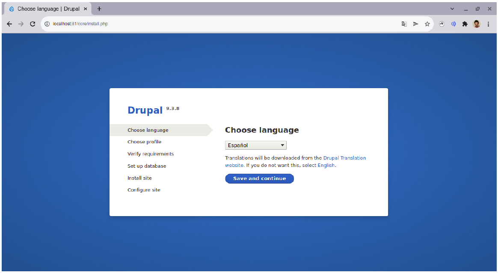
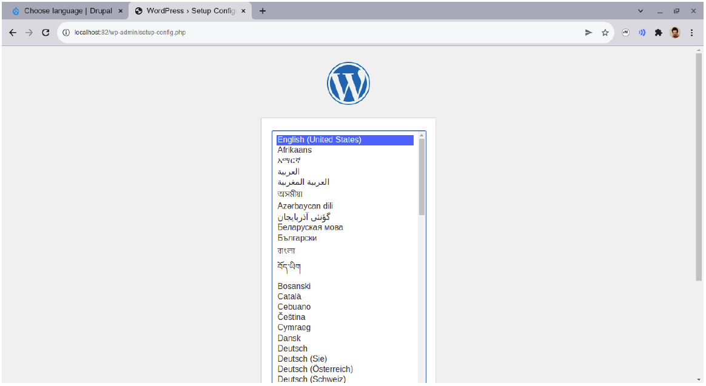

# Tarea: Práctica 3

_(Tarea disponible en el Campus Virtual)_

Subir el fichero `docker-compose.yml` creado y todo lo necesario, y además, un documento PDF con la explicación de la configuración realizada en el fichero. Incluir también las capturas donde se requiera mostrar en el navegador el correcto funcionamiento de los contenedores.

---

## Parte 1

1) Crear un fichero `docker-compose.yml` con dos servicios: drupal + mysql.
2) Hacer que el servicio drupal utilice el puerto 81.
3) Hacer que ambos contenedores usen un volumen `volumenDocker`.
4) Comprobar que puede acceder a `localhost:81` y puede visualizar la página de configuración de drupal.

## Solución de la parte 1

### Contenido de `docker-compose.yml`

``` yaml
version: '3'                        // Version de docker compose
services:                           // distintos servicios que se van a usar
 db:                                // nombre del servicio que maneja la base de datos en mysql
  image: mysql                      // imagen que va a usar el contenedor
  environment:                      // directrices del entorno de la base de datos
   - MYSQL_DATABASE=drupal          // nombre de la base de datos
   - MYSQL_ROOT_PASSWORD=drupal     // contraseña del usuario root de la bd
  volumes:                          // volumen que usa el contenedor
   - volumenDocker:/var/lib/mysql   // nombre del volumen y carpeta principal
 drupal:                            // nombre del servicio que maneja el contenedor drupal
  depends_on:                       // dependencias del servicio
   - db                             // nombre del servicio del que depende el contenedor
  ports:                            // redireccionamos los puertos
   - "81:80"                        // indicamos que queremos usar el puerto 81
  volumes:                          // volumen que usa el contenedor
   - volumenDocker:/app             // nombre del volumen y carpeta principal
volumes:                            // volúmenes que se usan en el docker-compose
 volumenDocker:                     // nombre del volumen usado
```

### Capturas



---

### Parte 2

1) Crear un fichero `docker-compose.yml` con dos servicios: wordpress +  mariadb.
2) Hacer que el servicio wordpress utilice el puerto 82.
3) Hacer que ambos contenedores usen la red `redDocker`.
4) Comprobar que puede acceder a `localhost:82` y puede visualizar la página de configuración de wordpress.

## Solución de la parte 2

### Contenido de `docker-compose.yml`


``` yaml
version: '3'                        // version del docker-compose
services:                           // servicios que contiene el docker compose
 db:                                // servicio de la base de datos
  image: mariadb:latest             // imagen que usa la base de datos
  environment:                      // directrices del entorno de la base de datos
   - MYSQL_DATABASE=wordpress       // nombre de la base de datos
   - MYSQL_ROOT_PASSWORD=mariadb    // contraseña del usuario root de la bd
  networks:                         // redes que usa el contenedor
   - redDocker                      // nombre de la red que usa el contenedor
 web:                               // servicio que contiene la web
  image: wordpress:latest           // imagen que usa el contenedor
  depends_on:                       // dependencias del contenedor
   - db                             // el nombre del servicio del que depende
  ports:                            // asignación de puertos
   - "82:80"                        // indicamos que usamos el puerto 82
  networks:                         // redes que usa el contenedor
   - redDocker                      // nombre de la red que usa el contenedor
networks:                           // redes que usa el docker-compose
 redDocker:                         // nombre de la red usada en el docker-compose
```

### Capturas

